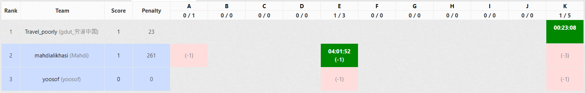

## About
* Contest was held in 2019/10/10
* Contest's length was 5 hours
* [link](https://vjudge.net/contest/331416) to contest
* Unfortunately, The GYM Codeforces servers came down for some hours

## Problems
1. [Tritwise Mex](https://codeforces.com/gym/102129/problem/A)
2. [Associativity Degree](https://codeforces.com/gym/102129/problem/B)
3. [Medium Hadron Collider](https://codeforces.com/gym/102129/problem/C)
4. [Basis Change](https://codeforces.com/gym/102129/problem/D)
5. [Scored Nim](https://codeforces.com/gym/102129/problem/E)
6. [Milliarium Aureum](https://codeforces.com/gym/102129/problem/F)
7. [Permutant](https://codeforces.com/gym/102129/problem/G)
8. [Game Of Chance](https://codeforces.com/gym/102129/problem/H)
9. [Incomparable Pairs](https://codeforces.com/gym/102129/problem/I)
10. [The Zong of the Zee](https://codeforces.com/gym/102129/problem/J)
11. [Expected Value](https://codeforces.com/gym/102129/problem/K)

## Scoreboard
